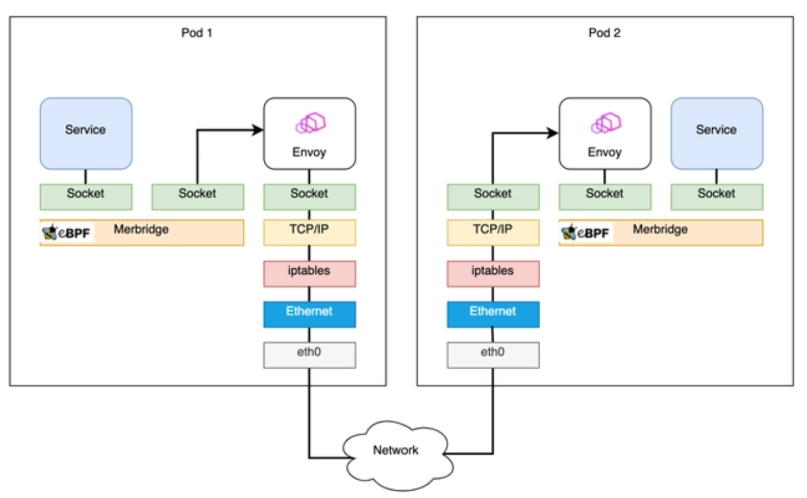

# eBPF sockops Example

## Performance Optimization using eBPF sockops

Network connections are essentially communication between sockets. eBPF provides a [bpf_msg_redirect_hash](https://man7.org/linux/man-pages/man7/bpf-helpers.7.html) function, which allows packets sent by applications to be directly forwarded to the destination socket, greatly accelerating the packet processing flow in the kernel.

Here, sock_map is the crucial part that records socket rules, i.e., based on the current packet information, a socket connection is selected from sock_map to forward the request. Therefore, it is necessary to save the socket information to sock_map at the hook of sockops or elsewhere, and provide a key-based rule (generally a four-tuple) to find the socket.

The Merbridge project uses eBPF instead of iptables to accelerate Istio. After using Merbridge (eBPF) optimization, inbound and outbound traffic will bypass many kernel modules, significantly improving performance, as shown in the figure below:



## Running the Example

This example program redirects traffic from the sender's socket (outbound) to the receiver's socket (inbound), **bypassing the TCP/IP kernel network stack**. In this example, we assume that the sender and receiver are running on the **same machine**.

### Compiling the eBPF Program

```shell
# Compile the bpf_sockops program
clang -O2 -g -Wall -target bpf -c bpf_sockops.c -o bpf_sockops.o
clang -O2 -g -Wall -target bpf -c bpf_redir.c -o bpf_redir.o
```

### Loading the eBPF Program

```shell
sudo ./load.sh
```

You can use the [bpftool utility](https://github.com/torvalds/linux/blob/master/tools/bpf/bpftool/Documentation/bpftool-prog.rst) to check if these two eBPF programs have been loaded.

```console
$ sudo bpftool prog show
63: sock_ops  name bpf_sockmap  tag 275467be1d69253d  gpl
 loaded_at 2019-01-24T13:07:17+0200  uid 0
 xlated 1232B  jited 750B  memlock 4096B  map_ids 58
64: sk_msg  name bpf_redir  tag bc78074aa9dd96f4  gpl
 loaded_at 2019-01-24T13:07:17+0200  uid 0
 xlated 304B  jited 233B  memlock 4096B  map_ids 58
```

### Running the [iperf3](https://iperf.fr/) Server

```shell
iperf3 -s -p 10000
```

### Running the [iperf3](https://iperf.fr/) Client

```shell
iperf3 -c 127.0.0.1 -t 10 -l 64k -p 10000
```

### Collecting Traces

```console
$ ./trace.sh
iperf3-9516  [001] .... 22500.634108: 0: <<< ipv4 op = 4, port 18583 --> 4135
iperf3-9516  [001] ..s1 22500.634137: 0: <<< ipv4 op = 5, port 4135 --> 18583
iperf3-9516  [001] .... 22500.634523: 0: <<< ipv4 op = 4, port 19095 --> 4135
iperf3-9516  [001] ..s1 22500.634536: 0: <<< ipv4 op = 5, port 4135 --> 19095
```

You should be able to see 4 events for socket establishment. If you don't see any events, the eBPF program may not have been attached correctly.

### Unloading the eBPF Program

```shell
sudo ./unload.sh
```

## References

- <https://github.com/zachidan/ebpf-sockops>- <https://github.com/merbridge/merbridge>